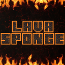

# LavaSponge

    

*Dry the Nether!* • [Downloads](https://github.com/Ender-Development/LavaSponge-Fabric/releases) • [CurseForge](https://www.curseforge.com/minecraft/mc-mods/lavasponge-fabric) • [Modrinth](https://modrinth.com/mod/lavasponge-fabric)

&nbsp;

## Introduction

LavaSponge is a Mod for Minecraft made by `Ender-Development`.

Lava Sponge adds a - who guessed it - Lava Sponge, which sucks up lava instead of water. It is pretty useful, when adventuring through the nether and looking for Ancient Debris. Since it often generates next to lava lakes. After clearing the Lava the Sponge turns into it's wet state, where it needs to be dried before it can be used again.
To dry a Lava Sponge it needs to be placed in the Overworld, where it will cool down. A Cool Lava Sponge needs to be mined with a diamond pickaxe.

(FYI: They won't get destroyed in lava or fire.)

## Vanilla+ Mod Collection

The VMC (short for `Vanilla+ Mod Collection`) is a assortment of small mods, which aims to enhance the user experience and offer a wide range of single purpose mods while staying as vanilla-ish as possible.

## [Ender-Development](https://github.com/Ender-Development)

Our Team currently includes:

`_MasterEnderman_` - Project-Manager, Lead-Artist, Developer

- BuyMeACoffee: <https://www.buymeacoffee.com/masterenderman>
- Curseforge: <https://www.curseforge.com/members/endermanwhosearchthebeast/projects>
- Discord: <https://discord.gg/JF7x2vG>
- GitHub: <https://github.com/masterenderman>
- Patreon: <https://www.patreon.com/_masterenderman_>
- Twitch: <https://www.twitch.tv/endermanwhosearchthebeast>
- Twitter: <https://twitter.com/_bitfabrik_>
- Youtube: <https://www.youtube.com/user/xxmasterendermanxx>

`Klebestreifen` - Lead-Developer, Artist

- Curseforge: <https://www.curseforge.com/members/klebe0815/projects>
- Discord: <https://discord.gg/nva5gGt>
- GitHub: <https://github.com/Klebestreifen>
- Twitch: <https://www.twitch.tv/klebe0815>
- Website: <https://klebe.io/>

## Community

Ender-Development is part of a Gaming Community called `Pixel-Friends.com`

- Website: <https://pixel-friends.com>
- Facebook: <http://facebook.com/GrischaNetwork/>
- Twitter: <http://twitter.com/GrischaNetwork>
- Twitch: <http://twitch.tv/grischabock>
- Steam: <http://steamcommunity.com/groups/Pixel-Friends>
- Instagram: <http://instagram.com/grischanetwork>
